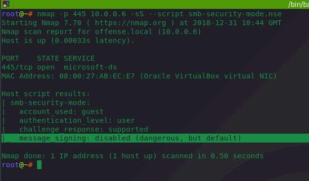
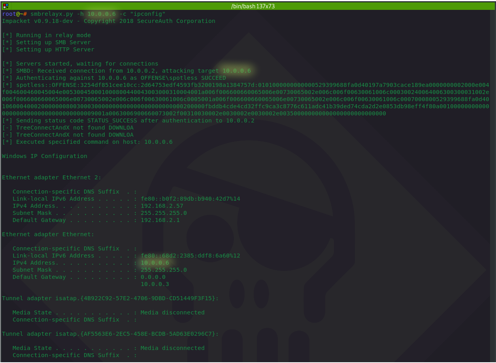
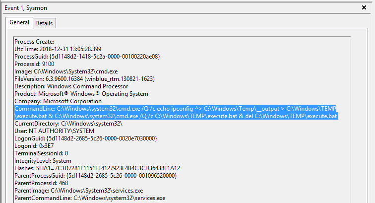
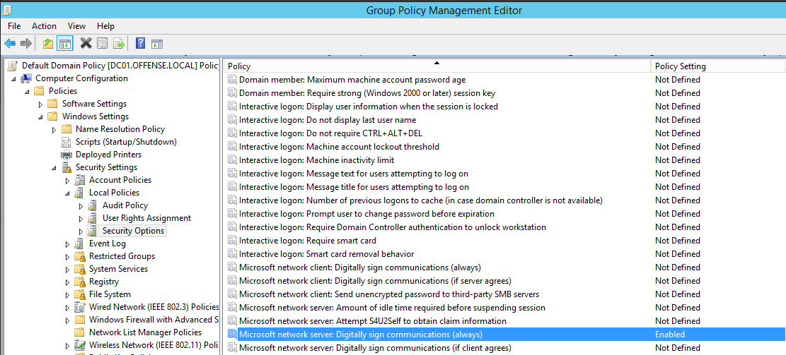
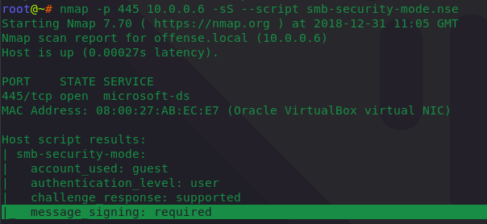

# Lateral Movement via SMB Relaying

This lab looks at a lateral movement technique abusing SMB protocol if SMB signing is disabled. 

SMB signing is a security mechanism that allows digitally signing SMB packets to enforce their authenticity and integrity - the client/server knows that the incoming SMB packets they are receiving are coming from a trusted source and that they have not been tampered with while in transit, preventing man in the middle type attacks.

If SMB signing is disabled, howeverm packets can be intercepted/modified and/or relayed to another system, which is what this lab is about.

## Environment

* 10.0.0.5 - attacker running Kali linux and smb relaying tool
* 10.0.0.2 - victim1; their credentials will be relayed to victim2
* 10.0.0.6 - victim2; code runs on victim2 with victim1 credentials


Credentials from Victim1 must be for a local admin on Victim2 or be a member of Administrators/Domain Administrators group for this attack to work successfully.


Below is a simplified process of how this attack works:

`10.0.0.2` -authenticates to-&gt; `10.0.0.5` -relays to-&gt; `10.0.0.6` executes code with victim1\(10.0.0.2\) credentials

## Execution

One of the ways to check if SMB signing is `disabled` on an endpoint:



```csharp
nmap -p 445 10.0.0.6 -sS --script smb-security-mode.nse
```





Since we know that victim2@10.0.0.6 has SMB signing disabled and is vulnerable to SMB relaying attack, let's create a simple HTML file that once opened will force the victim1 to authenticate to attacker's machine:



```markup
<html>
    <h1>holla good sir</h1>
    
</html>
```




Any other forced authentication method will also work - follow below link for a list of techniques.




...at the same time, let's fire up SMBRelayx tool that will listen for incoming SMB authentication requests and will relay them to victim2@10.0.0.6 and will attempt to execute a command `ipconfig`on the end host:



```text
smbrelayx.py -h 10.0.0.6 -c "ipconfig"
```




Note that smbrelayx could be used with a `-e` switch that allows attacker to execute their payload file - say, a meterpreter executable.


Below is a gif showing the technique in action - on the left - `victim1@10.0.0.2` opening the malicious html we crafted earlier that forces it to attempt to authenticate to the attacker system \(on the right\). Once the authentication attempt comes in, it gets relayed to `victim2@10.0.0.6` and ipconfig gets executed:


A stop frame from the above gif that highlights that the code execution indeed happend on 10.0.0.6:



## Observations & Mitigation

Smbrelayx.py leaves a pretty good footprint for defenders in Microsoft-Windows-Sysmon/Operational - the parent image is services.exe and the commandline has juicy details - note though that the commandline arguments are subject to forgery:



In order to mitigate this type of attack, the best way to do it is by implementing GPOs if possible by setting the policy **Microsoft network client: Digitally sign communications \(always\)** to `Enabled`:



With the above change, trying to execute the same attack, we get `Signature is REQUIRED` errors message and lateral movement is prevented:


The same nmap scan we did earlier now also shows that the `message signing is required`:



```csharp
nmap -p 445 10.0.0.6 -sS --script smb-security-mode
```





## References








