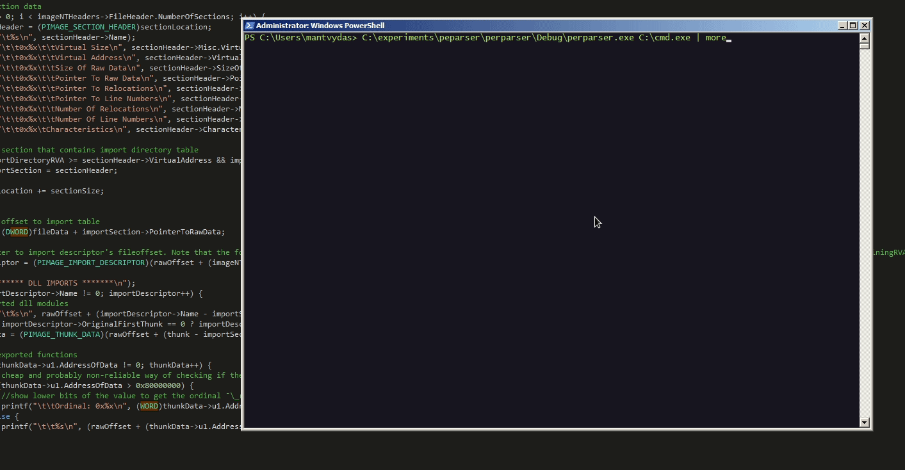

# Parsing PE File Headers with C++

## Context

In this lab I'm writing a simple Portable Executable \(PE\) file header parser for 32bit binaries, using C++ as the programming language of choice.

The purpose of this lab is two-fold:

* Get a bit more comfortable with C++
* Get a better understanding of PE file headers

This lab is going to be light on text as most of the relevant info is shown in the code below, but I will touch on the piece that confused me the most in this endevour.

Below is a graphic showing the end result - a program that parses a 32bit cmd.exe executable and spits out various pieces of information of from various headers as well as DLL imports.




* The code is not made to work for 64bit executables
* The code was not meant to be clean and well organised as it was not the goal of this lab
* The parser is not full-blown - it only goes through the headers and DLL imports only \(no exports, relocations or resources, etc\)


## The Big Hurdle

For the most part of this lab, header parsing was going smoothly, until it was time to parse the DLL imports. Boy this was fun and mind twisting.

## Code

```cpp
#include "stdafx.h"
#include "Windows.h"
#include <iostream>

int main(int argc, char* argv[]) {
	const int MAX_FILEPATH = 255;
	char fileName[MAX_FILEPATH] = {0};
	memcpy_s(&fileName, MAX_FILEPATH, argv[1], MAX_FILEPATH);
	HANDLE file = NULL;
	DWORD fileSize = NULL;
	DWORD bytesRead = NULL;
	LPVOID fileData = NULL;
	PIMAGE_DOS_HEADER dosHeader = {};
	PIMAGE_NT_HEADERS imageNTHeaders = {};
	PIMAGE_SECTION_HEADER sectionHeader = {};
	PIMAGE_SECTION_HEADER importSection = {};
	IMAGE_IMPORT_DESCRIPTOR* importDescriptor = {};
	PIMAGE_THUNK_DATA thunkData = {};
	DWORD thunk = NULL;
	DWORD rawOffset = NULL;

	// open file
	file = CreateFileA(fileName, GENERIC_ALL, FILE_SHARE_READ, NULL, OPEN_EXISTING, FILE_ATTRIBUTE_NORMAL, NULL);
	if (file == INVALID_HANDLE_VALUE) printf("Could not read file");
	
	// allocate heap
	fileSize = GetFileSize(file, NULL);
	fileData = HeapAlloc(GetProcessHeap(), 0, fileSize);
	
	// read file bytes to memory
	ReadFile(file, fileData, fileSize, &bytesRead, NULL);

	// IMAGE_DOS_HEADER
	dosHeader = (PIMAGE_DOS_HEADER)fileData;
	printf("******* DOS HEADER *******\n");
	printf("\t0x%x\t\tMagic number\n", dosHeader->e_magic);
	printf("\t0x%x\t\tBytes on last page of file\n", dosHeader->e_cblp);
	printf("\t0x%x\t\tPages in file\n", dosHeader->e_cp);
	printf("\t0x%x\t\tRelocations\n", dosHeader->e_crlc);
	printf("\t0x%x\t\tSize of header in paragraphs\n", dosHeader->e_cparhdr);
	printf("\t0x%x\t\tMinimum extra paragraphs needed\n", dosHeader->e_minalloc);
	printf("\t0x%x\t\tMaximum extra paragraphs needed\n", dosHeader->e_maxalloc);
	printf("\t0x%x\t\tInitial (relative) SS value\n", dosHeader->e_ss);
	printf("\t0x%x\t\tInitial SP value\n", dosHeader->e_sp);
	printf("\t0x%x\t\tInitial SP value\n", dosHeader->e_sp);
	printf("\t0x%x\t\tChecksum\n", dosHeader->e_csum);
	printf("\t0x%x\t\tInitial IP value\n", dosHeader->e_ip);
	printf("\t0x%x\t\tInitial (relative) CS value\n", dosHeader->e_cs);
	printf("\t0x%x\t\tFile address of relocation table\n", dosHeader->e_lfarlc);
	printf("\t0x%x\t\tOverlay number\n", dosHeader->e_ovno);
	printf("\t0x%x\t\tOEM identifier (for e_oeminfo)\n", dosHeader->e_oemid);
	printf("\t0x%x\t\tOEM information; e_oemid specific\n", dosHeader->e_oeminfo);
	printf("\t0x%x\t\tFile address of new exe header\n", dosHeader->e_lfanew);

	// IMAGE_NT_HEADERS
	imageNTHeaders = (PIMAGE_NT_HEADERS)((DWORD)fileData + dosHeader->e_lfanew);
	printf("\n******* NT HEADERS *******\n");
	printf("\t%x\t\tSignature\n", imageNTHeaders->Signature);
	
	// FILE_HEADER
	printf("\n******* FILE HEADER *******\n");
	printf("\t0x%x\t\tMachine\n", imageNTHeaders->FileHeader.Machine);
	printf("\t0x%x\t\tNumber of Sections\n", imageNTHeaders->FileHeader.NumberOfSections);
	printf("\t0x%x\tTime Stamp\n", imageNTHeaders->FileHeader.TimeDateStamp);
	printf("\t0x%x\t\tPointer to Symbol Table\n", imageNTHeaders->FileHeader.PointerToSymbolTable);
	printf("\t0x%x\t\tNumber of Symbols\n", imageNTHeaders->FileHeader.NumberOfSymbols);
	printf("\t0x%x\t\tSize of Optional Header\n", imageNTHeaders->FileHeader.SizeOfOptionalHeader);
	printf("\t0x%x\t\tCharacteristics\n", imageNTHeaders->FileHeader.Characteristics);

	// OPTIONAL_HEADER
	printf("\n******* OPTIONAL HEADER *******\n");
	printf("\t0x%x\t\tMagic\n", imageNTHeaders->OptionalHeader.Magic);
	printf("\t0x%x\t\tMajor Linker Version\n", imageNTHeaders->OptionalHeader.MajorLinkerVersion);
	printf("\t0x%x\t\tMinor Linker Version\n", imageNTHeaders->OptionalHeader.MinorLinkerVersion);
	printf("\t0x%x\t\tSize Of Code\n", imageNTHeaders->OptionalHeader.SizeOfCode);
	printf("\t0x%x\t\tSize Of Initialized Data\n", imageNTHeaders->OptionalHeader.SizeOfInitializedData);
	printf("\t0x%x\t\tSize Of UnInitialized Data\n", imageNTHeaders->OptionalHeader.SizeOfUninitializedData);
	printf("\t0x%x\t\tAddress Of Entry Point (.text)\n", imageNTHeaders->OptionalHeader.AddressOfEntryPoint);
	printf("\t0x%x\t\tBase Of Code\n", imageNTHeaders->OptionalHeader.BaseOfCode);
	//printf("\t0x%x\t\tBase Of Data\n", imageNTHeaders->OptionalHeader.BaseOfData);
	printf("\t0x%x\t\tImage Base\n", imageNTHeaders->OptionalHeader.ImageBase);
	printf("\t0x%x\t\tSection Alignment\n", imageNTHeaders->OptionalHeader.SectionAlignment);
	printf("\t0x%x\t\tFile Alignment\n", imageNTHeaders->OptionalHeader.FileAlignment);
	printf("\t0x%x\t\tMajor Operating System Version\n", imageNTHeaders->OptionalHeader.MajorOperatingSystemVersion);
	printf("\t0x%x\t\tMinor Operating System Version\n", imageNTHeaders->OptionalHeader.MinorOperatingSystemVersion);
	printf("\t0x%x\t\tMajor Image Version\n", imageNTHeaders->OptionalHeader.MajorImageVersion);
	printf("\t0x%x\t\tMinor Image Version\n", imageNTHeaders->OptionalHeader.MinorImageVersion);
	printf("\t0x%x\t\tMajor Subsystem Version\n", imageNTHeaders->OptionalHeader.MajorSubsystemVersion);
	printf("\t0x%x\t\tMinor Subsystem Version\n", imageNTHeaders->OptionalHeader.MinorSubsystemVersion);
	printf("\t0x%x\t\tWin32 Version Value\n", imageNTHeaders->OptionalHeader.Win32VersionValue);
	printf("\t0x%x\t\tSize Of Image\n", imageNTHeaders->OptionalHeader.SizeOfImage);
	printf("\t0x%x\t\tSize Of Headers\n", imageNTHeaders->OptionalHeader.SizeOfHeaders);
	printf("\t0x%x\t\tCheckSum\n", imageNTHeaders->OptionalHeader.CheckSum);
	printf("\t0x%x\t\tSubsystem\n", imageNTHeaders->OptionalHeader.Subsystem);
	printf("\t0x%x\t\tDllCharacteristics\n", imageNTHeaders->OptionalHeader.DllCharacteristics);
	printf("\t0x%x\t\tSize Of Stack Reserve\n", imageNTHeaders->OptionalHeader.SizeOfStackReserve);
	printf("\t0x%x\t\tSize Of Stack Commit\n", imageNTHeaders->OptionalHeader.SizeOfStackCommit);
	printf("\t0x%x\t\tSize Of Heap Reserve\n", imageNTHeaders->OptionalHeader.SizeOfHeapReserve);
	printf("\t0x%x\t\tSize Of Heap Commit\n", imageNTHeaders->OptionalHeader.SizeOfHeapCommit);
	printf("\t0x%x\t\tLoader Flags\n", imageNTHeaders->OptionalHeader.LoaderFlags);
	printf("\t0x%x\t\tNumber Of Rva And Sizes\n", imageNTHeaders->OptionalHeader.NumberOfRvaAndSizes);

	// DATA_DIRECTORIES
	printf("\n******* DATA DIRECTORIES *******\n");
	printf("\tExport Directory Address: 0x%x; Size: 0x%x\n", imageNTHeaders->OptionalHeader.DataDirectory[0].VirtualAddress, imageNTHeaders->OptionalHeader.DataDirectory[0].Size);
	printf("\tImport Directory Address: 0x%x; Size: 0x%x\n", imageNTHeaders->OptionalHeader.DataDirectory[1].VirtualAddress, imageNTHeaders->OptionalHeader.DataDirectory[1].Size);

	// SECTION_HEADERS
	printf("\n******* SECTION HEADERS *******\n");
	// get offset to first section headeer
	DWORD sectionLocation = (DWORD)imageNTHeaders + sizeof(DWORD) + (DWORD)(sizeof(IMAGE_FILE_HEADER)) + (DWORD)imageNTHeaders->FileHeader.SizeOfOptionalHeader;
	DWORD sectionSize = (DWORD)sizeof(IMAGE_SECTION_HEADER);
	
	// get offset to the import directory RVA
	DWORD importDirectoryRVA = imageNTHeaders->OptionalHeader.DataDirectory[IMAGE_DIRECTORY_ENTRY_IMPORT].VirtualAddress;

	// print section data
	for (int i = 0; i < imageNTHeaders->FileHeader.NumberOfSections; i++) {
		sectionHeader = (PIMAGE_SECTION_HEADER)sectionLocation;
		printf("\t%s\n", sectionHeader->Name);
		printf("\t\t0x%x\t\tVirtual Size\n", sectionHeader->Misc.VirtualSize);
		printf("\t\t0x%x\t\tVirtual Address\n", sectionHeader->VirtualAddress);
		printf("\t\t0x%x\t\tSize Of Raw Data\n", sectionHeader->SizeOfRawData);
		printf("\t\t0x%x\t\tPointer To Raw Data\n", sectionHeader->PointerToRawData);
		printf("\t\t0x%x\t\tPointer To Relocations\n", sectionHeader->PointerToRelocations);
		printf("\t\t0x%x\t\tPointer To Line Numbers\n", sectionHeader->PointerToLinenumbers);
		printf("\t\t0x%x\t\tNumber Of Relocations\n", sectionHeader->NumberOfRelocations);
		printf("\t\t0x%x\t\tNumber Of Line Numbers\n", sectionHeader->NumberOfLinenumbers);
		printf("\t\t0x%x\tCharacteristics\n", sectionHeader->Characteristics);

		// save section that contains import directory table
		if (importDirectoryRVA >= sectionHeader->VirtualAddress && importDirectoryRVA < sectionHeader->VirtualAddress + sectionHeader->Misc.VirtualSize) {
			importSection = sectionHeader;
		}
		sectionLocation += sectionSize;
	}

	// get file offset to import table
	rawOffset = (DWORD)fileData + importSection->PointerToRawData;
	
	// get pointer to import descriptor's fileoffset. Note that the formula for calculating file offset is: imageBaseAddress + pointerToRawDataOfTheSectionContainingRVAofInterest + (RVAofInterest - SectionContainingRVAofInterest.VirtualAddress)
	importDescriptor = (PIMAGE_IMPORT_DESCRIPTOR)(rawOffset + (imageNTHeaders->OptionalHeader.DataDirectory[IMAGE_DIRECTORY_ENTRY_IMPORT].VirtualAddress - importSection->VirtualAddress));
	
	printf("\n******* DLL IMPORTS *******\n");	
	for (; importDescriptor->Name != 0; importDescriptor++)	{
		// imported dll modules
		printf("\t%s\n", rawOffset + (importDescriptor->Name - importSection->VirtualAddress));
		thunk = importDescriptor->OriginalFirstThunk == 0 ? importDescriptor->FirstThunk : importDescriptor->OriginalFirstThunk;
		thunkData = (PIMAGE_THUNK_DATA)(rawOffset + (thunk - importSection->VirtualAddress));
		
		// dll exported functions
		for (; thunkData->u1.AddressOfData != 0; thunkData++) {
			//a cheap and probably non-reliable way of checking if the function is imported via its ordinal number ¯\_(ツ)_/¯
			if (thunkData->u1.AddressOfData > 0x80000000) {
				//show lower bits of the value to get the ordinal ¯\_(ツ)_/¯
				printf("\t\tOrdinal: 0x%x\n", (WORD)thunkData->u1.AddressOfData);
			} else {
				printf("\t\t%s\n", (rawOffset + (thunkData->u1.AddressOfData - importSection->VirtualAddress + 2)));
			}
		}
	}

    return 0;
}
```

## References

